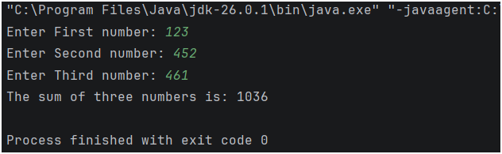

## Java Practice Question – Sum of Three Numbers

This folder contains a Java program that solves a **basic practice question** using input, output, and arithmetic operations.

It is intended for beginners to strengthen their understanding of **core Java fundamentals** through simple problem-solving.

---

## 📌 Program Overview

The program in this folder covers the following practice question:

- Calculate the **sum of three numbers** provided by the user.

The program takes user input from the console and displays the calculated sum clearly.

---

## 🧪 Code Functionality

The program demonstrates:

### Arithmetic Operations
- Addition (`+`)

### Input Handling
- Importing and utilizing `java.util.Scanner` for reading console input
- Accepting integer input (`nextInt()`) for three separate numbers
- Calculating the total sum and displaying the result

The program is written in a **simple and readable format**.

---

## 🖥️ Output

The program prints the calculated sum directly to the console after taking user input.  
The complete console output for this practice question is shown below.

---

## 📂 File Information

- `Sum_of_numbers.java` — Contains the practice question program  
- `Output.png` — Screenshot of console output  
- `README.md` — Folder documentation  

---
## 👨‍💻 Author

**MD Shahnawaz Noor**     
*Aspiring Data Scientist* 
   
GitHub: [https://github.com/shahnawaznoor2020-code](https://github.com/shahnawaznoor2020-code)             
Email: shahnawaznoor2020@gmaIl.com  
 
---

## ⭐ Note

These practice programs help build a strong foundation in Java.  
They are essential before moving to conditions, loops, and advanced logic.
