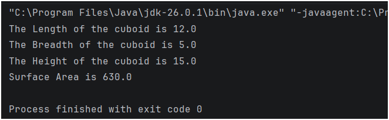

## Java Practice Question – Surface Area of a Cuboid

This folder contains a Java program that solves a **basic practice question** using variable assignment, output, and arithmetic operations.

It is intended for beginners to strengthen their understanding of **core Java fundamentals** through simple problem-solving.

---

## 📌 Program Overview

The program in this folder covers the following practice question:

- Calculate the **surface area of a cuboid** based on predefined length, breadth, and height.

The program uses predefined values and displays the calculated surface area clearly in the console.

---

## 🧪 Code Functionality

The program demonstrates:

### Arithmetic Operations
- Addition (`+`) and Multiplication (`*`)

### Mathematical Formulas
- Surface Area of a Cuboid: Surface Area = 2 * (length*breadth + length*height + breadth*height)

### Variable Handling
- Initializing double-precision floating-point variables (`double`) for length, breadth, and height
- Calculating the total surface area and displaying the result

The program is written in a **simple and readable format**.

---

## 🖥️ Output

The program prints the calculated surface area directly to the console during execution.  
The complete console output for this practice question is shown below.

---

## 📂 File Information

- `Surface_Area_of_Cuboid.java` — Contains the practice question program  
- `Output.png` — Screenshot of console output  
- `README.md` — Folder documentation  

---
## 👨‍💻 Author

**MD Shahnawaz Noor**     
*Aspiring Data Scientist* 
   
GitHub: [https://github.com/shahnawaznoor2020-code](https://github.com/shahnawaznoor2020-code)             
Email: shahnawaznoor2020@gmaIl.com  
 
---

## ⭐ Note

These practice programs help build a strong foundation in Java.  
They are essential before moving to conditions, loops, and advanced logic.
