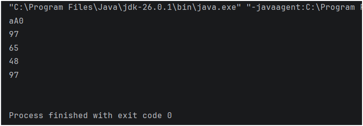

## Java Practice Question – Type Casting

This folder contains a Java program that solves a **basic practice question** using variable assignment, output, and type conversion.

It is intended for beginners to strengthen their understanding of **core Java fundamentals** through simple problem-solving.

---

## 📌 Program Overview

The program in this folder covers the following practice concepts:

- Understanding **implicit and explicit type casting** between different data types.
- Retrieving the integer (ASCII) values of character variables.
- Concatenating character variables into a string for display.

The program uses predefined character and integer values and displays the results clearly in the console.

---

## 🧪 Code Functionality

The program demonstrates:

### Type Casting
- **Implicit Type Casting**: Automatically converting a smaller type (`char`) to a larger type (`int`).
- **Explicit Type Casting**: Manually casting variables using parentheses, e.g., `(int) ch2` or `(char) a`.

### Variable Handling
- Initializing character variables (`char`) and integer variables (`int`).
- Exploring the numeric ASCII values behind characters like 'a' (97), 'A' (65), and '0' (48).
- Combining character variables into a string using `+ ""` concatenation.

The program is written in a **simple and readable format**.

---

## 🖥️ Output

The program prints the type-casted values directly to the console during execution.  
The complete console output for this practice question is shown below.

---

## 📂 File Information

- `Type_CAsting.java` — Contains the practice question program  
- `Output.png` — Screenshot of console output  
- `README.md` — Folder documentation  

---
## 👨‍💻 Author

**MD Shahnawaz Noor**     
*Aspiring Data Scientist* 
   
GitHub: [https://github.com/shahnawaznoor2020-code](https://github.com/shahnawaznoor2020-code)             
Email: shahnawaznoor2020@gmaIl.com  
 
---

## ⭐ Note

These practice programs help build a strong foundation in Java.  
They are essential before moving to conditions, loops, and advanced logic.
