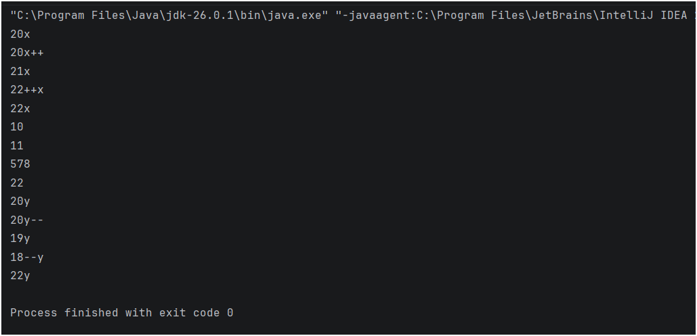

## Java Practice Question – Unary Operators

This folder contains a Java program that solves a **basic practice question** using variable assignment, output, and unary operators.

It is intended for beginners to strengthen their understanding of **core Java fundamentals** through simple problem-solving.

---

## 📌 Program Overview

The program in this folder covers the following practice concepts:

- Demonstrate the use of **unary increment and decrement operators**.
- Illustrate the difference between pre-increment/decrement and post-increment/decrement.
- Show the use of a compound assignment operator.

The program uses predefined integer values and displays the sequential changes clearly in the console.

---

## 🧪 Code Functionality

The program demonstrates:

### Unary Operators
- **Post-increment (`x++`)**: Uses the current value first, then increments it by 1.
- **Pre-increment (`++x`)**: Increments the value by 1 first, then uses it.
- **Post-decrement (`y--`)**: Uses the current value first, then decrements it by 1.
- **Pre-decrement (`--y`)**: Decrements the value by 1 first, then uses it.

### Compound Assignment
- **Addition assignment (`+=`)**: Adds a value to a variable and assigns the result back to the variable (e.g., `a+=567`).

### Variable Handling
- Initializing integer variables (`int`) and observing how their values change during execution.

The program is written in a **simple and readable format**.

---

## 🖥️ Output

The program prints the modified values directly to the console during execution.  
The complete console output for this practice question is shown below.

---

## 📂 File Information

- `Urany_operator.java` — Contains the practice question program  
- `Output.png` — Screenshot of console output  
- `README.md` — Folder documentation  

---
## 👨‍💻 Author

**MD Shahnawaz Noor**     
*Aspiring Data Scientist* 
   
GitHub: [https://github.com/shahnawaznoor2020-code](https://github.com/shahnawaznoor2020-code)             
Email: shahnawaznoor2020@gmaIl.com  
 
---

## ⭐ Note

These practice programs help build a strong foundation in Java.  
They are essential before moving to conditions, loops, and advanced logic.
